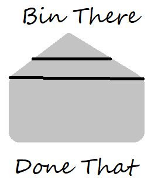
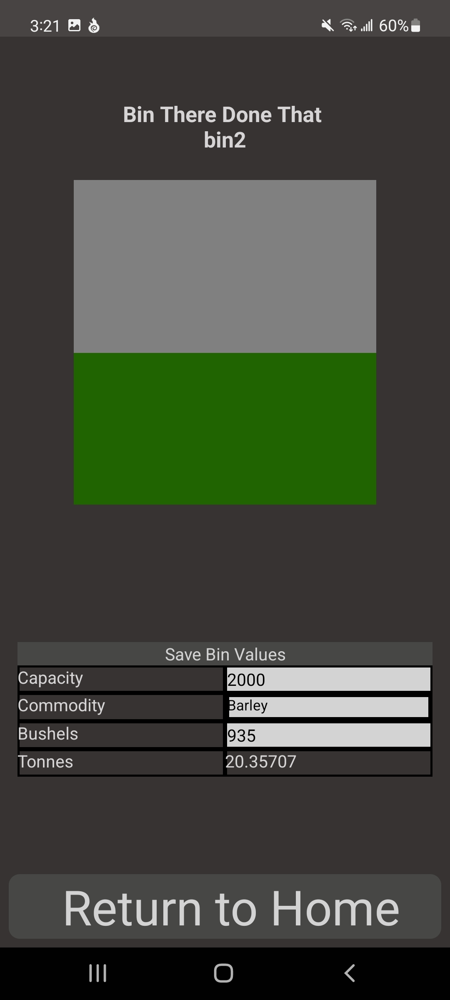
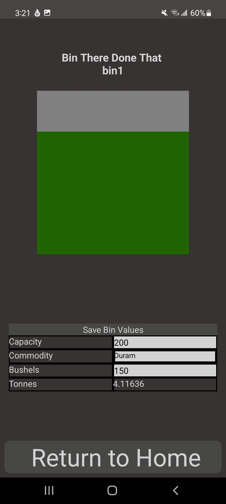
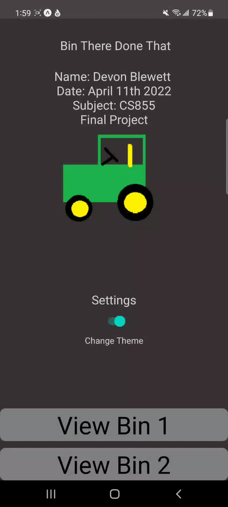
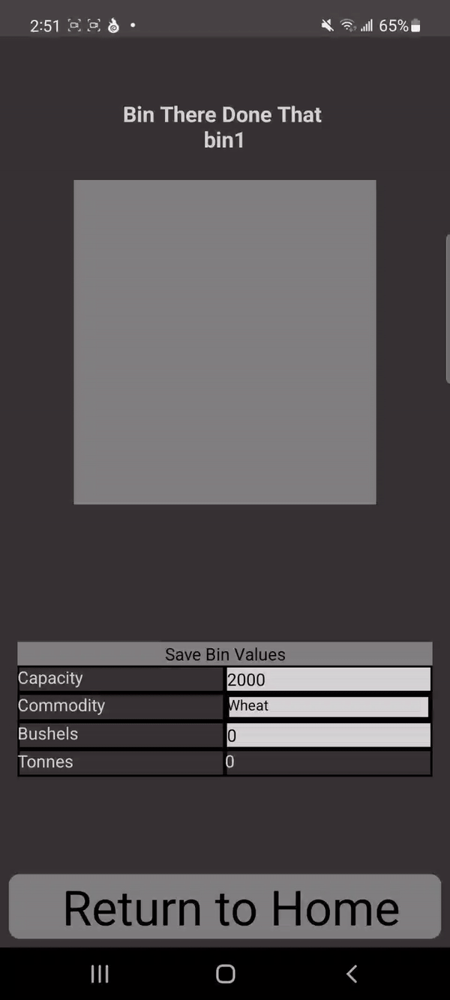
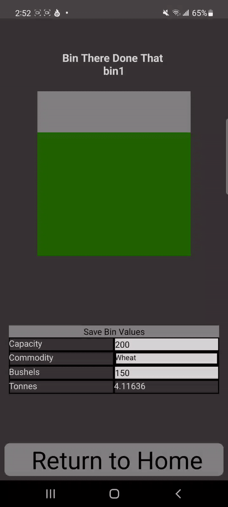
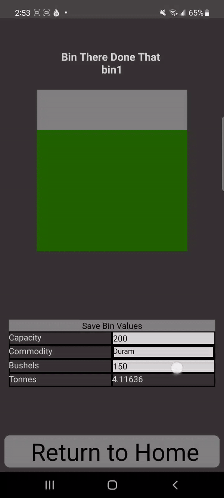
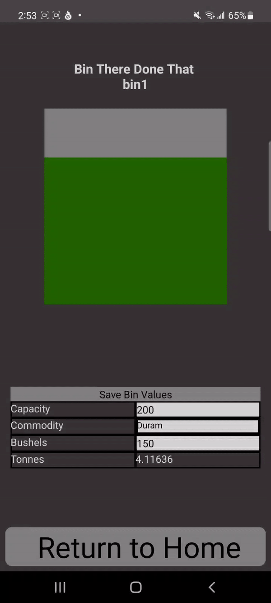

# Bin There Done That - Bin Management Program

## Introduction
Bin There Done That is a mobile app created for my CS855 final project.  It helps manage two grain bins by taking values such as capacity and number of bushels, automatically calculating the tonnes based on the grain selected, storing the data internally, and providing a visual indicator for how full the bin is.

 

## Contents

## Features
- Adjust the total capacity, amount of bushels, and select a type of grain from a predefined list
- Automatically calculates the tonnes based on the volume of the bushel for that type of grain
- Animated visual indicator representing how full the bin is that updates when the capacity or bushels is changed
- Stores bin information internally using AsyncStorage
- Confirmation and error checking when submitting new values
- Dark and light colour theme
- Haptic feedback when entering numbers
 
## Manifest

## Installation

### Install to your Android device
A current version of the program can be run by downloading and running the apk on your android device.  If the download doesn't automatically prompt you to install the apk, find it in your downloads folder and install it from there.

> [Click here or view the releases tab on the right to download the apk](https://github.com/Colourfull/BinThereDoneThat/releases/download/Release/BinThereDoneThat.apk)

If this is your first time downloading and installing an apk outside of the Play Store, you may be prompted several times for security reasons, such as downloading files from Chrome that may affect your device and running unknown programs.  You will need to approve all these for the app to run.

This program was designed for Android devices.  It does not have an Apple release.

### Run with Expo Snacks

If you would like to try the app without trusting unknown sources, you can also run the program on your phone with Expo Snacks, which allows previews of small projects without downloading them.

If you haven't already, you will need to install the Expo Go app from the Play Store.

Click the following link to be taken to the Expo Snack for this project.

> [https://snack.expo.dev/@blewedev/855project](https://snack.expo.dev/@blewedev/855project)

Once there, click the "My Device" tab on the preview.  Scan the QR code with your phone, and it will automatically launch the app.

Please note that while there is a web preview, not all the features used in this app are compatible with it, so the app won't work from there.

## Usage Instructions

### Home Screen
The home screen will load by default.  It contains a switch you can tap on to change between light and dark colour theme and two buttons to navigate to two storage bins.

### Bin Screen
The bin screen loads one of two bins, depending on which button you pressed in the previous screen.

In this screen, you can edit the text inputs for bushels or capacity, select a type of grain to store from the dropdown list, or save your changes to local storage.

#### Updating numeric values
To update a numeric field, tap on it and enter a number.  Due to the regular expression, it may appear like you can enter non-numbers, but non-numeric characters will automatically be removed.  This conveniently also prevents negative numbers.

Updating the numeric fields will automatically update the bin indicator above.  Updating the bushels will update the tonnes based on what type of grain is selected from the list.

#### Updating the grain type
To select a grain to store in the bin, tap on the dropdown and pick from the list.  Since different grains have different sizes of bushels, the type of grain selected will change the tonnes (except wheat and duram, because they are the same size).

#### Saving values to local storage

To save the entered values to local storage, tap the save bin values icon.  If the bin has more bushels than the capacity allows, you will get an error.

If the values work, you will get a confirmation screen.  Select confirm, and your results will be saved to local storage, and the bin will keep what you entered on future visits.

## Known bugs

- Sometimes the tonnes field doesn't update appropriately when a bin is just loaded and the grain type is changed 

- Backspacing the capacity all the way to blank breaks the bin indicator

## Support

If there are problems running the app, feel free to contact me at blewedev@uregina.ca

## Built With
This app was built using React Native and the Expo CLI.  It makes use of the following libraries:

- AsyncStorage - Handles internal storage of grain bin values.
https://www.npmjs.com/package/@react-native-async-storage/async-storage

- Modal dropdown - Used for the list of grains in the table
https://www.npmjs.com/package/react-native-modal-dropdown

- React stack navigator - For navigation between the home screen and the bin screen
https://reactnavigation.org/docs/stack-navigator/

- React-csv - Used to try and download csv files of the bin data to the device, but unfortunately doesn't work for now
  https://www.npmjs.com/package/react-csv

## License

This work is licensed under an MIT lisence.  See LICENSE.md for more information

## Project Status
This project will not likely be continued.  It was just meant to fulfill requirements for my course.
  
## Credits and acknowledgements
Josiah Mahar for providing me with the information I would need in the table and the values to calculate tonnes

Trevor Tomesh, Lecturer at the University of Regina, for providing examples to reference when building this project

EZGif video to gif maker for allowing me to easily convert screencaptures to gifs for the README
